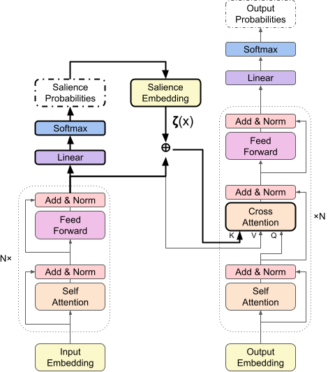

# Salience Allocation Guided Abstractive Summarization
Code and model weights for our paper ["Salience Allocation as Guidance for Abstractive Summarization"](https://arxiv.org/abs/2210.12330) accepted at EMNLP 2022. If you find the code useful, please cite the following paper.

    @inproceedings{wang2022salience,
      title={Salience Allocation as Guidance for Abstractive Summarization},
      author={Wang, Fei and Song, Kaiqiang and Zhang, Hongming and Jin, Lifeng and Cho, Sangwoo and Yao, Wenlin and Wang, Xiaoyang and Chen, Muhao and Yu, Dong},
      booktitle={Proceedings of the 2022 Conference on Empirical Methods in Natural Language Processing},
      year={2022}
    }

## Quick Links
  - [Overview](#overview)
  - [Environment](#environment)
  - [Data Preprocessing](#data-preprocessing)
  - [Train](#train)
  - [Inference](#inference)

## Overview
We propose allocation of salience expectation as flexible and reliable guidance for abstractive summarization.
To estimate and incorporate the salience allocation, 
we propose a salience-aware cross-attention that is free to plug into any Transformer-based encoder-decoder models, 
consisting of three steps:
1. [Estimate salience degrees of each sentence](https://github.com/tencent-ailab/season/blob/32eafea39a00bc09daa29c187d566e7cc9c262fa/model.py#L1260).
2. [Map salience degrees to embeddings](https://github.com/tencent-ailab/season/blob/32eafea39a00bc09daa29c187d566e7cc9c262fa/model.py#L199).
3. [Add salience embeddings to key states of cross-attention](https://github.com/tencent-ailab/season/blob/32eafea39a00bc09daa29c187d566e7cc9c262fa/model.py#L205).

<div align='center'>
    

    
</div>

## Environment

Create the environment with conda and pip. 
```shell
conda env create -f environment.yml
conda activate season
pip install -r requirements.txt
```
Install nltk "punkt" package.
```shell
python -c "import nltk; nltk.download('punkt');"
```
We've tested this environment with python 3.8 and cuda 10.2. (For other CUDA version, please install the corresponding packages)

## Data Preprocessing
Run the following commands to download the CNN/DM dataset, preprocess it, and save it locally.
```shell
mkdir data
python preprocess.py
```

## Train
Please run the scripts below:
```shell
bash run_train.sh
```
The trained model parameters and training logs are saved in `outputs/train` folder.

Note that the evaluation process for each checkpoint during training are simplified for efficiency, so the results are lower than the final evaluation results. You can change the setting according to [this post](https://discuss.huggingface.co/t/evaluation-results-metric-during-training-is-different-from-the-evaluation-results-at-the-end/15401). You can further evaluate the trained model by following the inference steps.

## Inference
You can use our trained model weights to generate summaries for your data.

Step 1. Download [Trained Model Weights](https://tencentoverseas-my.sharepoint.com/:u:/g/personal/riversong_global_tencent_com/ERIOkK_Ka01Es0qc7VK-uX8BfxqUfiULeVHDHfwmnnMi3Q?e=NiAeXr) to ``checkpoints`` directory.
```bash
mkdir checkpoints
cd checkpoints
unzip season_cnndm.zip
```

Step 2. Generate summaries for CNN/DM Test set.
```bash
bash run_inference.sh
```
After running the script, you will get the results in `outputs/inference` folder including the predicted summaries in `generated_predictions.txt` and the ROUGE results in `predict_results.json`.

## License
   Copyright 2022 Tencent

   Licensed under the Apache License, Version 2.0 (the "License");
   you may not use this file except in compliance with the License.
   You may obtain a copy of the License at

       http://www.apache.org/licenses/LICENSE-2.0

   Unless required by applicable law or agreed to in writing, software
   distributed under the License is distributed on an "AS IS" BASIS,
   WITHOUT WARRANTIES OR CONDITIONS OF ANY KIND, either express or implied.
   See the License for the specific language governing permissions and
   limitations under the License.
   
## Disclaimer
This repo is only for research purpose. It is not an officially supported Tencent product. 
